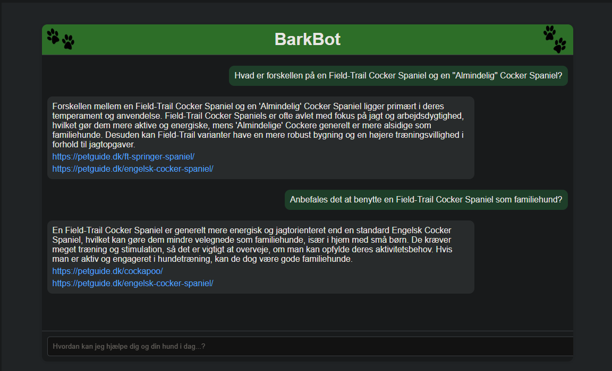

# DeepBark

DeepBark is a Retrieval-Augmented Generation (RAG) solution designed to assist dog owners by providing accurate and helpful information on dog care—from feeding and training to breed-specific guidance. Leveraging advanced natural language processing techniques, DeepBark retrieves and generates concise answers based on a curated collection of articles and provides direct links to the original sources.

## Purpose

The purpose of this project is to build a RAG-solution. The knowledge base is based on publicly available documents and the use of a RAG-service might not be as relevant as for "private documents".

## Interface display



## Table of Contents

- [Introduction](#introduction)
- [Features](#features)
- [Installation](#installation)
- [Usage](#usage)
- [Project Structure](#project-structure)

## Introduction

DeepBark is an innovative chatbot application that helps dog owners quickly access expert advice on various topics such as dog nutrition, training tips, and breed information. By combining a powerful retrieval system with a language generation model, DeepBark delivers precise answers along with source references for further reading. The interface is designed to be clean, modern, and user-friendly.

## Features

- **Accurate Answers:** Delivers precise responses by retrieving information from multiple trusted sources.
- **Source Links:** Provides clickable links to the original articles for in-depth reading.
- **User-Friendly Interface:** Modern and intuitive design for seamless interaction.
- **Responsive Design:** Built to work on various devices and screen sizes.

## Installation

### Prerequisites

- **Python 3.11.9**
- **Node.js** (for frontend development)
- **Conda** (for environment management)

### Setup

1. **Clone the Repository:**
   ```sh
   git clone https://github.com/MadsTTorp/DeepBark.git
   cd DeepBark
   ```

2. **Create and Activate the Conda Environment**
   ```sh
    conda env create -f environment.yml
    conda activate deepbark-gpt
   ```

3. **Install the Required Python Packages:**
   ```sh
    pip install -r requirements.txt
   ```

4. **Run the Application:**
   ```sh
    uvicorn app.main:app --reload
   ```

### Project structure

```
DeepBark/
├── app/
│   ├── main.py         # FastAPI application entry point
│   ├── api/            # API endpoints and logic
│   └── frontend/       # HTML/CSS/JS for the frontend
├── assets/             # Images and static assets (backgrounds, logos, etc.)
├── doc/                # Documentation and images (Deepbark-logo.png, UI-interface.png)
├── environment.yml     # Conda environment file
├── requirements.txt    # Python dependencies
└── README.md           # This file
```
