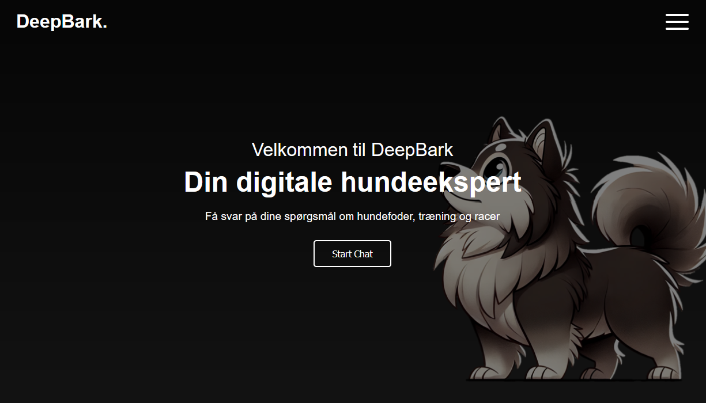

# BarkBot

Barkbot is a Retrieval-Augmented Generation (RAG) solution designed to assist dog owners by providing accurate and helpful information based on several articles. The application leverages advanced natural language processing techniques to answer questions and provide relevant sources.


## Table of Contents

- Introduction
- Features
- Installation
- Usage
- Project Structure
- Contributing
- License

## Introduction

Barkbot is a chatbot application that helps dog owners find answers to their questions about dog care, feeding, training, and more. The application uses a RAG model to retrieve relevant information from a collection of articles and generate concise answers. The sources of the information are also provided as links for further reading.

## Features

- **Accurate Answers**: Provides precise answers to user questions based on a collection of articles.
- **Source Links**: Includes links to the sources of the information for further reading.
- **User-Friendly Interface**: Simple and intuitive chat interface for easy interaction.

## Installation

### Prerequisites

- Python 3.11.9
- Node.js (for frontend development)
- Conda (for managing the environment)

### Setup

1. Clone the repository:
    ```sh
    git clone https://github.com/yourusername/woof-wisdom.git
    cd woof-wisdom
    ```

2. Create and activate the Conda environment:
    ```sh
    conda env create -f environment.yml
    conda activate woofwisdom-gpt
    ```

3. Install the required Python packages:
    ```sh
    pip install -r requirements.txt
    ```

4. Run the application:
    ```sh
    uvicorn app.main:app --reload
    ```

## Usage

1. Open your web browser and navigate to `http://127.0.0.1:8000`.
2. Type your question in the input box and press Enter.
3. The chatbot will display the answer along with links to the sources of the information.



## Contributing

Contributions are welcome! Please read the contributing guidelines for more information.

## License

This project is licensed under the MIT License. See the LICENSE file for details.